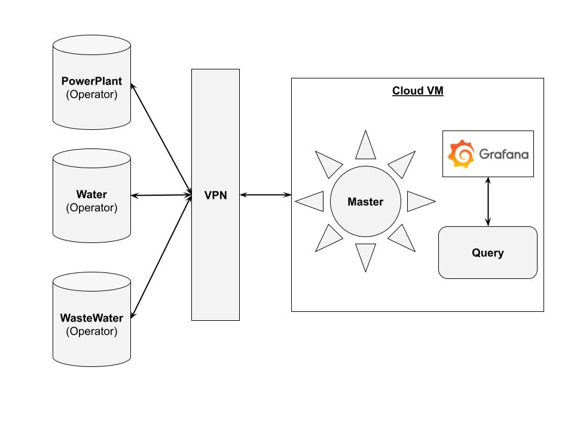
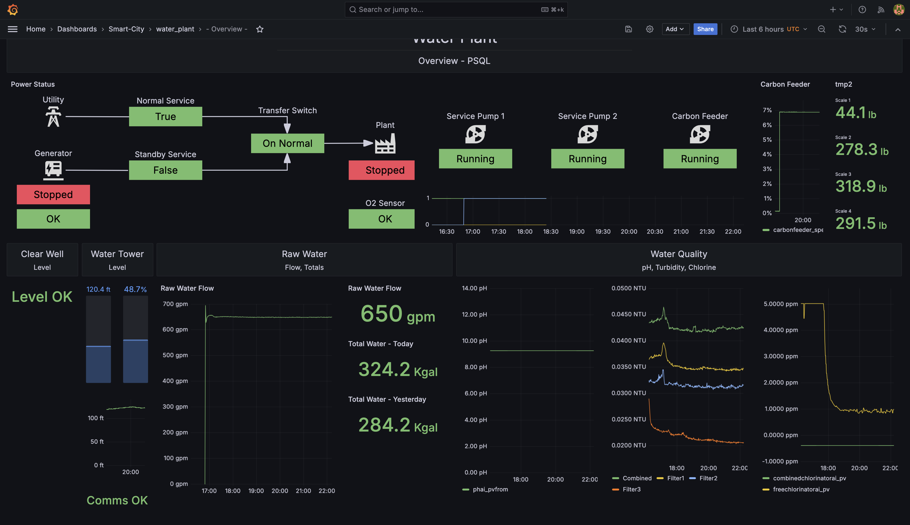

# Smart City

The following demonstrates a smart city deployment with AnyLog / EdgeLake and [Dynics Fusion](https://dynics.com/product/ics360-fusion/). 

The city select for this demo was Sabetha (Kansas), and provides information regaridng _Electrical Power_, _Water_ and 
_Waste Water_.

The project was done by [AnyLog](https://anylog.co), [Bachelor Controls](https://www.bachelorcontrols.com/) and 
[Dynics](https://dynics.com/) and is sponsored by [Linux Foundation - Edge Group](https://lfedge.org/). 

Farther details can be found [here](https://lfedge.org/wp-content/uploads/sites/24/2024/08/LFEdge_-Sabetha_Case-Study.pdf?utm_content=304190290&utm_medium=social&utm_source=twitter&hss_channel=tw-1085641282175741952). 

## Setup
* An AnyLog master and query docker containers that seat on the cloud - the node also contains a Grafana instance
* 3 physical machines that seat at the Edge receiving data. The machine contain the following services
  * An AnyLog operator that acts as a database layer  
  * Dynics Fusion to receive data from devices and send into AnyLog

Due to security reasons, the network has a VPN address which is used for communicating between the cloud instances and 
the edge.



## Replications
Steps to Reproduce setup. This can be done with either Linux or Windows

1. [Install Docker](https://docs.docker.com/engine/install/) on each of the nodes being used - used by AnyLog / EdgeLake and Grafana  
2. Using [docker-compose](https://github.com/AnyLog-co/docker-compose), deploy AnyLog for each node type
   * Make sure to update `LEDGER_CONN` value appropriately for each AnyLog node type
   * If VPN is used, update the `OVERLAY_IP` as needed
3. [Install fusion](https://docs.dynics.com/fusion/#/manual/getting-started/installation) By Dynics 
4. Import [flows](Dynics%20Backups%202024-08-21.zip) into Dynics - [documentation](https://docs.dynics.com/fusion/#/manual/flows)
   * Update the [resources](https://docs.dynics.com/fusion/#/manual/resources-overview/resource-types) with appropriate URLs
   * Update the REST header flow(s) with appropriate Database and table name 
5. [Install Grafana](https://grafana.com/docs/grafana/latest/setup-grafana/installation/)
6. Import [Grafana Dashboards](grafana/) into your Grafana instance

## Grafana
The data coming into AnyLog / EdgeLake can be viewed via Grafana. Each Dashboard consists of no more than 4 queries, with 
the panels referencing a single panel / widget. 

```tree
── grafana
   ├── power_plant
   │   ├── generators.json
   │   ├── monitor.json
   │   └── overview.json
   ├── waste_water
   │   ├── blowers.json
   │   ├── equipment.json
   │   ├── high_flow.json
   │   ├── overview.json
   │   └── plant_status.json
   └── water_plant
       ├── overview.json
```

### Sample Dashboards 

